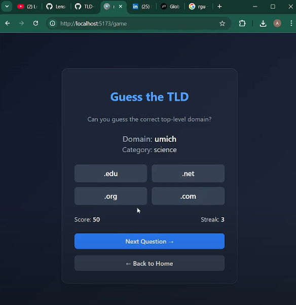

# TLD Guesser


Check this out (Click on the image it's a video)
[](https://www.youtube.com/watch?v=XIQxmLpuFYw)

<br/>



TLD Guesser is a machine learning project that predicts the top-level domain (TLD) of a website (such as `.com`, `.org`, `.edu`, `.co.uk`, etc.) based on its base name and optionally its category.  
It also includes an interactive web-based game where users can guess the TLD of randomly selected domains.

The project consists of:
- A **Flask backend** for model inference and API endpoints
- A **React (Vite + Tailwind)** frontend for prediction and gameplay
- Two trained machine learning models for inference:
  - `tld_predictor.pkl` (uses both base name and category)
  - `tld_base_predictor_v2.pkl` (uses only base name)

---

## Project Overview

The goal of this project is to explore lexical and categorical patterns in domain names.  
Given a website name and optionally its category, the model predicts the most likely TLD.

Examples:
- Input: `github` + `computers` → `.com`
- Input: `mit` + `education` → `.edu`
- Input: `bbc` + `news` → `.co.uk`

---

## Dataset

The dataset was compiled from **Curlie.org (formerly DMOZ)**, a categorized web directory containing URLs organized by topic.

After processing, the dataset included approximately **1.48 million rows** with the following structure:

| Column | Description |
|---------|--------------|
| id | Row identifier |
| url | Full URL |
| base_name | Extracted base domain (e.g., "github") |
| tld | True top-level domain (e.g., "com") |
| category | Website category (e.g., "computers") |

Data cleaning steps included:
- Removing null or malformed rows
- Filtering out TLDs with fewer than 100 occurrences
- Creating balanced gameplay and training subsets

---

## Machine Learning Approach

### Feature Engineering
- Used **character-level TF-IDF** vectorization with n-grams ranging from 2–7.
- Example learned features: `gov`, `edu`, `uni`, `shop`, `bbc`, `ac.uk`.

### Models
| Model | Input | Accuracy | Description |
|--------|--------|-----------|-------------|
| `tld_predictor.pkl` | base_name + category | ~78% | Category-aware model |
| `tld_base_predictor_v2.pkl` | base_name only | ~59% | Balanced base-name-only model |

### Training Configuration
- Framework: scikit-learn
- Model: Logistic Regression (`solver='saga'`, `max_iter=800`)
- Vectorizer: `TfidfVectorizer(analyzer='char', ngram_range=(3,7), max_features=400000)`
- Train/test split: 90% / 10%
- Balanced dataset of 18 TLDs (each limited to 3,000–10,000 samples)

---

## Results

| Dataset | Model | Accuracy |
|----------|--------|-----------|
| Validation (category-aware) | `tld_predictor.pkl` | 77.95% |
| Validation (base-name-only) | `tld_base_predictor_v2.pkl` | 58.6% |
| Fair Gameplay Dataset (balanced) | `tld_base_predictor_v2.pkl` | 58.6% |

The model performs consistently across balanced datasets, correctly predicting common TLDs such as `.com`, `.org`, `.edu`, and `.gov`, and performs reasonably well on regional TLDs like `.co.uk` and `.com.au`.

---

## API

### `/api/question`
Returns a random domain and category with model predictions (used for gameplay).

Example response:
```json
{
  "domain": "github",
  "category": "computers",
  "options": ["com", "org", "io", "net"],
  "answer": "com",
  "options_with_scores": [
    {"tld": "com", "score": 0.82},
    {"tld": "org", "score": 0.10},
    {"tld": "io", "score": 0.05},
    {"tld": "net", "score": 0.03}
  ]
}
